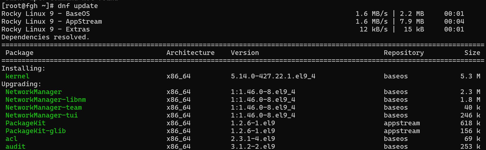

# Repositorios en Rocky Linux  

 Los repositorios contienen los paquetes de software necesarios para la instalación y actualización del sistema. Se gestionan mediante 'DNF' y se configuran en archivos ubicados en: 

📂 Ubicación de los archivos de repositorios:  

- '/etc/yum.repos.d/' = Contiene archivos '.repo' con la configuración de los repositorios.  

- '/etc/dnf/dnf.conf' = Archivo de configuración global de DNF.  

### Ejemplo de como se ve Rocky Linux

